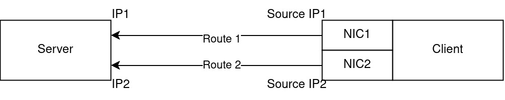

# ebpf reroute poc

This is a sample eBPF program to change a route of a packet, using Traffic Control program type. Please do not use this, it has a lot of problems.

## Usage

### Compilation

```bash
clang -g -O3 -xc -Wall -target bpf -c bpf.c -o bpf.o \
-DREDIRECT_FROM_PORT=... -DREDIRECT_TO_IP=... \
-DREDIRECT_TO_PORT=... -DREDIRECT_FROM_IP=... \
-DREDIRECT_TO_IFINDEX=... -DDREDIRECT_FROM_IFINDEX=...\
-DREDIRECT_FROM_SIP=... -DREDIRECT_TO_SIP=...
```

In a simple case we have 2 devices lets call them client
and server, eBPF program is on the client.
Client is connected to server by 2 routes that
go through by NIC1 and NIC2 respectively.
We want to change the route of the packet from route 1 to route 2.



- `REDIRECT_FROM_PORT` and `REDIRECT_TO_PORT` port of the packet that should be redirected
- `REDIRECT_FROM_IP` IP1 in the schme
- `REDIRECT_TO_IP` IP2 in the schema
- `REDIRECT_FROM_SIP` Source IP1 in the schema
- `REDIRECT_TO_SIP` Source IP2 in the schema
- `REDIRECT_FROM_IFINDEX` NIC1's ifindex
- `REDIRECT_TO_IFINDEX` NIC2's ifindex

See a sample in `compile.sh`

### Loading
To load the program you should run the following script (sample in init.sh)

```bash
tc qdisc add dev {nic1} clsact
tc qdisc add dev {nic2} clsact
tc filter add dev {nic1} egress bpf da obj bpf.o sec tc_egress
tc filter add dev {nic2} ingress bpf da obj bpf.o sec tc_ingress
```
### Unload
To unload the program you should run the following script (sample in clear.sh)

```bash
tc filter del dev {nic1} egress
tc filter del dev {nic2} ingress 
tc qdisc del dev {nic1} clsact
tc qdisc del dev {nic2} clsact
```


